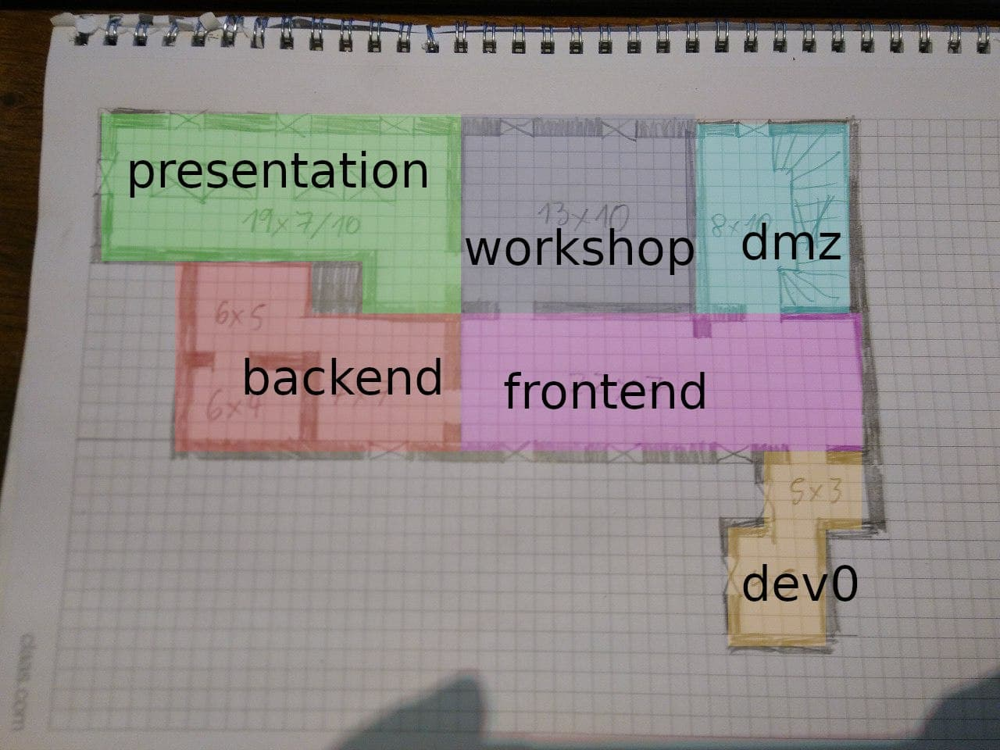

# workadventure-map-c2is

## Voraussetzung
* Ein github Account.

## Links zum Einstieg
* Beschreibung zum Erstellen von Karten: https://workadventu.re/map-building
* Ein Editor für die Karten: https://www.mapeditor.org/
* Slides vom RFCCv1: [BuildingAWorld](./presentation/BuildingAWorld.pdf)
* Testen der Karte(n): https://play.workadventu.re/_/global/chaos-consulting.github.io/workadventure-map-c2is/frontend.json

## Organisation
  * Jeder Raum eine JSON-Datei im "root"-Verzeichnis.
  * Alle Tilesets im Unterordner "tilesets".
 
## Räume

  * presentation
    * Exit-Layer: exit_workshop
    * Entry-Layer: entry_workshop
  * backend
    * Exit-Layer: exit_frontend
    * Entry-Layer: entry_frontend
  * workshop
    * Exit-Layer: exit_frontend, exit_presentation
    * Entry-Layer: entry_frontend, entry_presentation
  * frontend
    * Exit-Layer: exit_backend, exit_workshop, exit_dmz, exit_dev0
    * Exit-Layer: entry_backend, entry_workshop, entry_dmz, entry_dev0
  * dev0:
    * Exit-Layer: exit_frontend
    * Entry-Layer: entry_frontend

 
